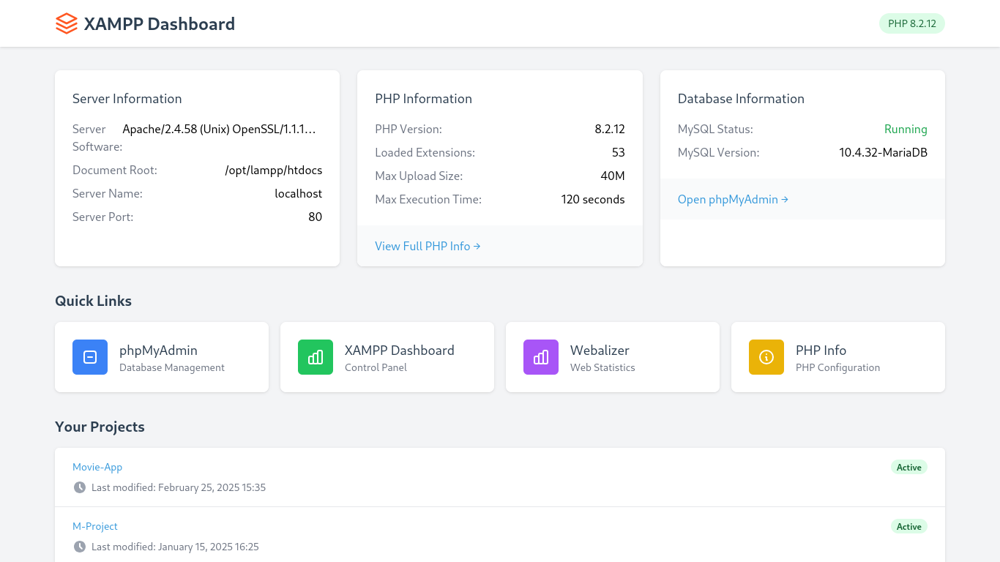

---

# **XAMPP Custom Dashboard Guide**  

A step-by-step guide to setting up a custom dashboard for XAMPP on Linux, Windows, or macOS.  

## **📌 Features**  
✅ Customizable homepage for XAMPP  
✅ Organize and manage local projects easily  
✅ Improve workflow efficiency  
✅ User-friendly and responsive design  

---
## **📸 Preview**

<p align="center">
  
</p>

---

## **🛠️ Prerequisites**  
Before starting, make sure you have the following:  
- **XAMPP Installed** → [Download Here](https://www.apachefriends.org/)  
- Basic knowledge of HTML, PHP, and CSS (optional but helpful)  
- **Node.js & npm** (if you want to modify the CSS using Tailwind)  

---

## **📂 Installation & Setup**  

### **1️⃣ Locate the XAMPP `htdocs` Directory**  
By default, the web root directory for XAMPP is:  
- **Windows**: `C:\xampp\htdocs\`  
- **Linux (Fedora/Ubuntu)**: `/opt/lampp/htdocs/`  
- **macOS**: `/Applications/XAMPP/htdocs/`  

### **2️⃣ Create a New Project Folder**  
Run the following command in the terminal (Linux/macOS) or Command Prompt (Windows):  
```bash
mkdir /opt/lampp/htdocs/  # Change path for Windows/macOS
```

### **3️⃣ Clone or Download This Repository**  
```bash
cd /opt/lampp/htdocs/
git clone https://github.com/Malvin555/XAMPP-Custom
```
Or manually download the files and extract them into the `htdocs/` folder.  

### **4️⃣ Set Proper Permissions (Linux Only)**  
If using Linux, set the correct folder permissions:  
```bash
sudo chown -R $USER:$USER /opt/lampp/htdocs
sudo chmod -R 755 /opt/lampp/htdocs
```

---

## **🎨 Customization**  
### **Modify CSS with TailwindCSS**  
If you want to customize the styles using Tailwind CSS, install it first:  
```bash
npm install tailwindcss @tailwindcss/cli
```
Then configure and build the CSS using:  
```bash
npx tailwindcss -i ./css/input.css -o ./css/output.css --watch
```
Now you can edit `input.css` and see live updates!

---

## **🚀 Usage**  
Open a browser and go to:  
```
http://localhost/
```
You should now see your custom XAMPP dashboard! 🎉  

---

## **🛠️ Troubleshooting**  
### ❌ *Dashboard Not Loading?*  
✔ Check Apache and MySQL services are running in the XAMPP control panel.  
---

## **💡 Contributing**  
Feel free to submit pull requests or suggest improvements!  

---

## **📜 License**  
MIT License - Free to use and modify.  

---

## **📞 Support**  
For any issues, open a GitHub **Issue** or contact me at [malvinbrine555@gmail.com]  
